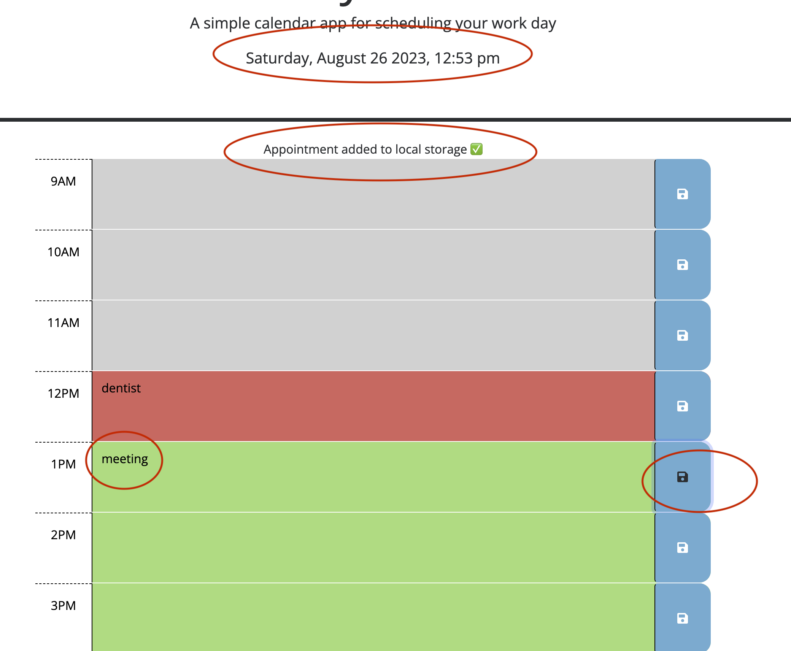

# Work Day Scheduler - Using Third Party APIs

## Description

The work day schedular is used to save a schedule of your 8hr day. Hours are denoted by past present and future. Only hours in the present or future can have appointments saved to. When it is refreshed, all items still remain. The day and time is denoted in local time using a third party API called Day.js.

## Usage

The date and time can be found across the top this is synced with day.js and is linked to the id #currentDay located in the header to show your local date and time. You are welcome to enter items in the bars. These denote past, present and future times. Click to save your item with the button on the right. When it is saved a message will pop up for 5 seconds saying it has been saved to local storage. When the page is refreshed, information from the local storage will be placed in page again using the getLocalStorage method using a for loop to replace each hour. The colors of the bar are updated to check that the past present and future are still correct.

## Deployment and GitHub
 deployment: https://pamwillis.github.io/WorkDayScheduler_Using3rdPartyAPIs/

Github repository: https://github.com/PamWillis/WorkDayScheduler_Using3rdPartyAPIs.git

## License

MIT License

Copyright (c) [2023] [Pam Willis]

Permission is hereby granted, free of charge, to any person obtaining a copy
of this software and associated documentation files (the "Software"), to deal
in the Software without restriction, including without limitation the rights
to use, copy, modify, merge, publish, distribute, sublicense, and/or sell
copies of the Software, and to permit persons to whom the Software is
furnished to do so, subject to the following conditions:

The above copyright notice and this permission notice shall be included in all
copies or substantial portions of the Software.

THE SOFTWARE IS PROVIDED "AS IS", WITHOUT WARRANTY OF ANY KIND, EXPRESS OR
IMPLIED, INCLUDING BUT NOT LIMITED TO THE WARRANTIES OF MERCHANTABILITY,
FITNESS FOR A PARTICULAR PURPOSE AND NONINFRINGEMENT. IN NO EVENT SHALL THE
AUTHORS OR COPYRIGHT HOLDERS BE LIABLE FOR ANY CLAIM, DAMAGES OR OTHER
LIABILITY, WHETHER IN AN ACTION OF CONTRACT, TORT OR OTHERWISE, ARISING FROM,
OUT OF OR IN CONNECTION WITH THE SOFTWARE OR THE USE OR OTHER DEALINGS IN THE
SOFTWARE..

## Credit
This was created with assistants from AskBCS Learning assistants, my tutor Juan Delgato for better explaining localStorage, my classmate Zak Richardson for typo checking and reviewing hide and show, and what was demonstrated in class.
